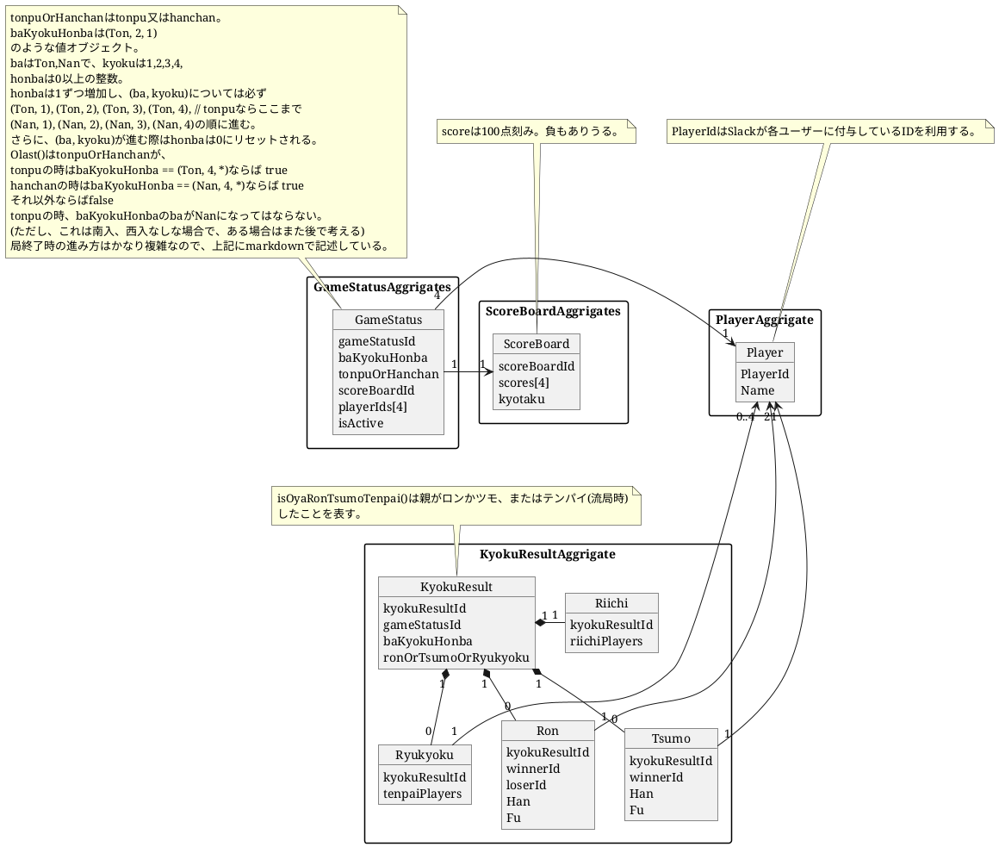

ドメインモデル図

局終了時のゲームの進み方:
- 誰かのscoreが負になる ゲーム終了
飛び終了なしの場合は後で考える
- オーラス時
  - 親がロンorツモorテンパイをして親が1位になった時: ゲーム終了
  - 親がロンorツモorテンパイをして親が1位にならない時: honbaが進む
  - 親がロンorツモorテンパイのいずれでもない時: ゲーム終了
- オーラスではない時
  - 親がロンorツモorテンパイをした時: honbaが進む
  - 親がロンorツモorテンパイのいずれでもない時: (ba, kyoku)が進む

gameの状況遷移図

